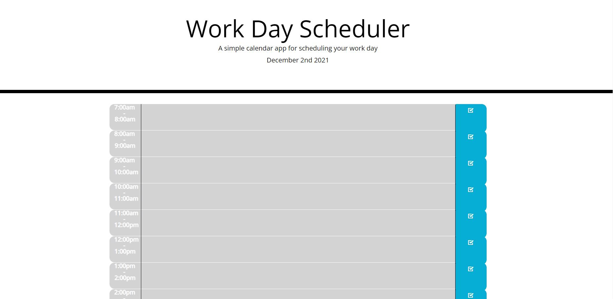
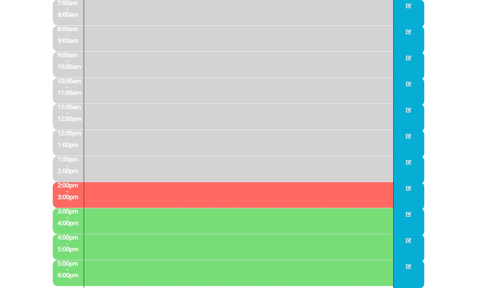

# Work Day Scheduler
An easy and organized way to plan your day!

## Table of Contents
* Intro
* Planner Format
* Saving Your Plans
* Conclusion

## Intro
Work Day Scheduler is an organized planner that users can interact with to help them keep track of time and plan their days accordingly. The user can save tasks they have scheduled throughout the day. Using three different color formats, the user can easily see which tasks were in the past, present, and future.

## Planner Format
Once the user visits the webpage, they will be presented with this image:

The planner starts at 7:00am and goes until 6:00pm. The user can just simply click on a timeblock to enter a task and then hit the save button on the right to save this task. Depending of what time it currently is, the planner will change the color for certain time blocks. This will help the user identify which tasks are in the past, present, or future. Past events are marked in grey, present events are marked red, and future events are marked in green. Below is a screenshot of what the user might see if their current time is 2:40pm:

The 2:00pm-3:00pm time block is displayed in red signifying that this is the present and that the remaining time blocks from here are green meaning they are in the future.

## Saving Your Plans
Once the user has entered a task and hit the save button, the browser will save that task. Using local storage, we are able to store this info and keep it displayed even if the user exits the webpage and comes back at a later time.

## Conclusion
The Work Day Planner is a great way to help busy individuals keep track of certain tasks throughout the day. Using the current day and time, we allow the user to visually see a representation of the tasks to do throughout the day to help keep their day as organized as possible.

Please visit the link below to start your planner:
https://tylerwiatrek.github.io/work-planner/

 
